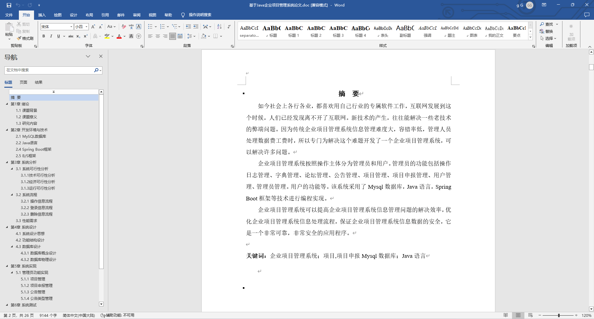
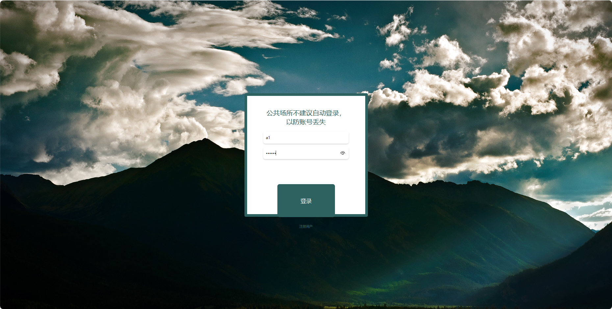
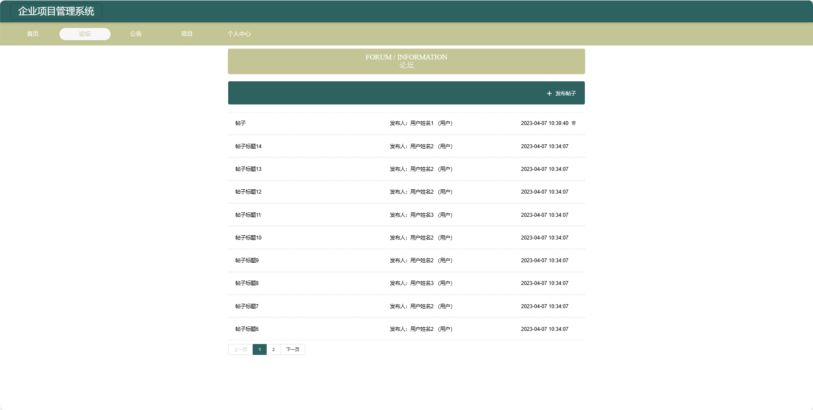
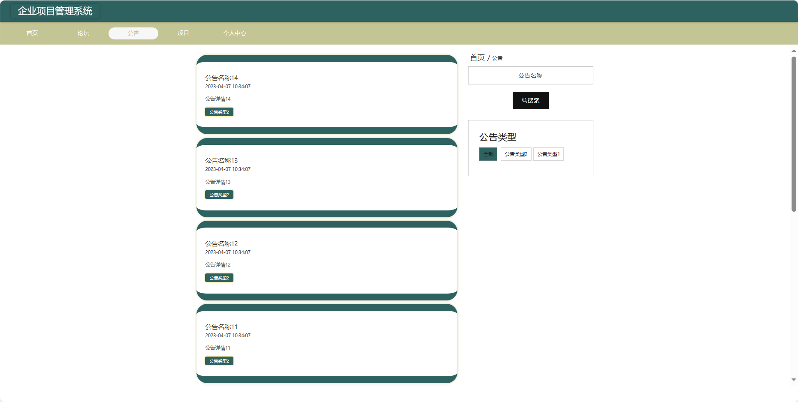
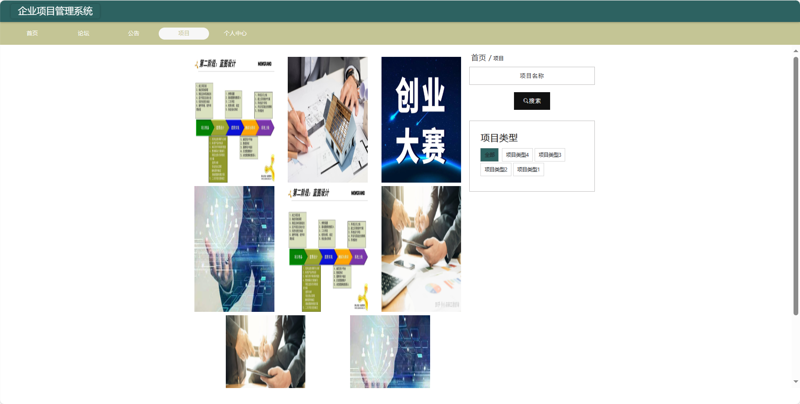
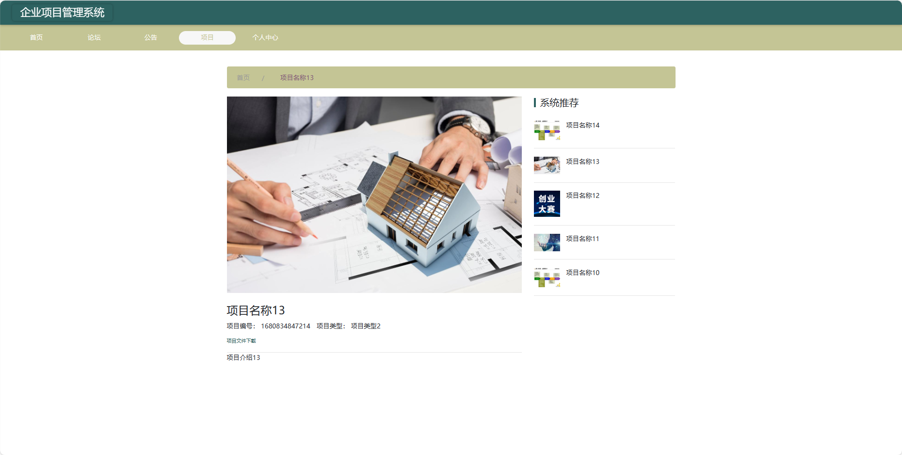
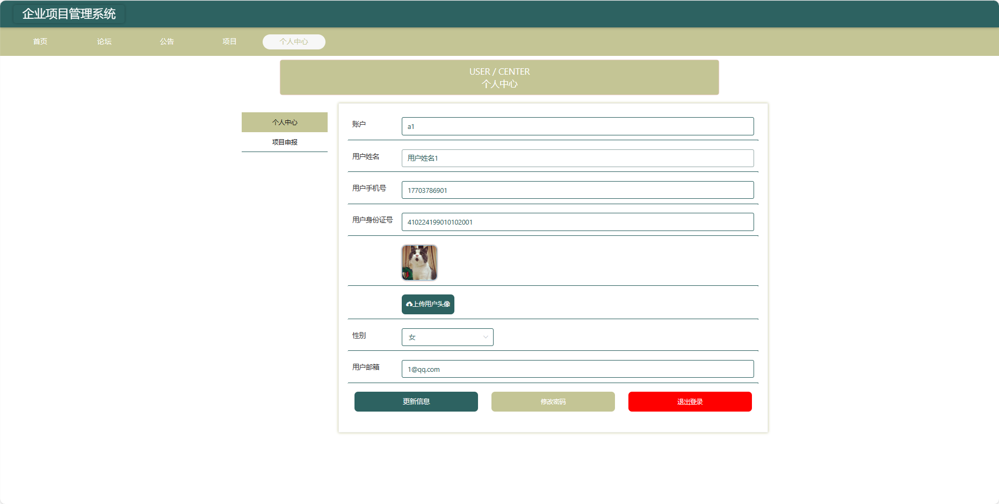
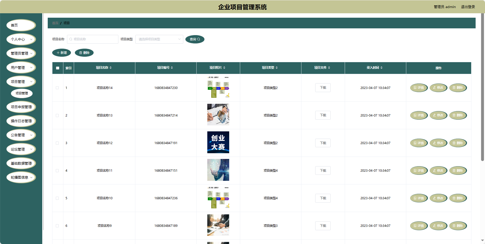
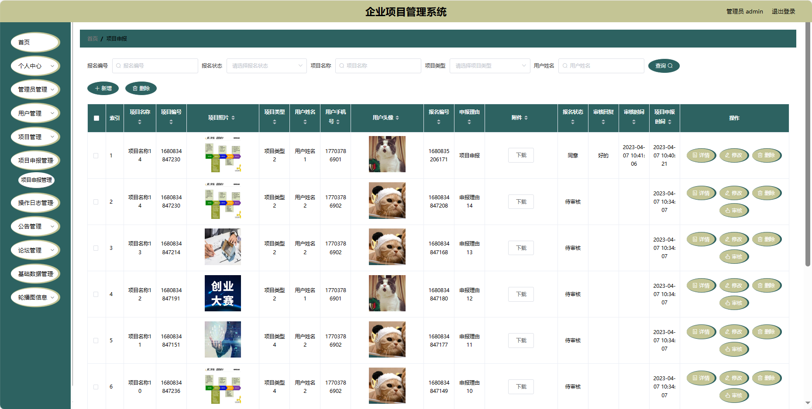
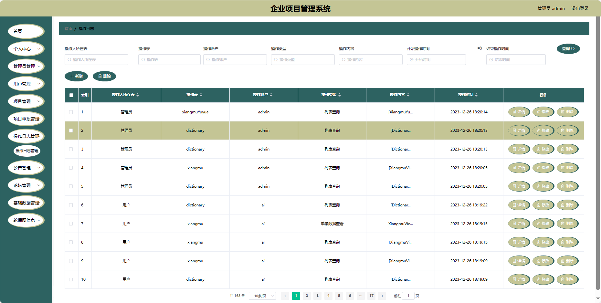

## 基于SpringBoot的企业项目管理系统(程序+报告)

###  获取sql数据库文件: 从戎源码网 (https://armycodes.com/) QQ: 386869957 QQ群: 377586148
###  所有系统地址: (https://github.com/YuLin-Coder/AllProjectCatalog) 
###  所有项目以及源代码本人均调试运行无问题 可支持远程安装部署调试、定制修改、代码讲解

## 项目介绍
基于SpringBoot的企业项目管理系统，系统包含两种角色：管理员、用户,系统分为前台和后台两大模块，主要功能如下。

### 【管理员】:
1. 首页：提供管理员进入后台管理的入口。
2. 个人中心：管理员可以管理个人信息。
3. 管理员管理：添加、编辑、删除系统管理员账号。
4. 用户管理：查看、编辑、冻结或删除用户账号。
5. 项目管理：查看、编辑、删除企业进行中的项目信息。
6. 项目申报管理：处理用户提交的项目申报请求。
7. 操作日志管理：记录系统的操作日志。
8. 公告管理：发布、编辑、删除企业项目的通知和公告。
9. 论坛管理：管理论坛板块。
10. 基础数据管理：管理系统的基础数据。
11. 轮播图信息：管理员可以设置首页轮播图。

### 【前台】:
1. 首页：提供用户进入系统的入口。
2. 论坛：用户可以在论坛上进行项目相关的讨论和交流。
3. 公告：发布企业项目的最新通知。
4. 项目：展示企业当前进行中的项目。
5. 个人中心：用户可以管理个人信息。

## 项目技术
- 编程语言：Java
- 数据库：MySQL
- 项目管理工具：Maven
- 前端技术：HTML、CSS、JavaScript、Jquery、Vue
- 后端技术：Spring、SpringMVC、MyBatis

## 运行环境
- JDK版本：JDK1.8及以上
- 开发工具：IDEA、Ecplise、Myecplise都可以
- 数据库: MySQL5.7及以上
- Maven：maven3.0及以上
- Node：14.14.0及以上

## 运行截图

